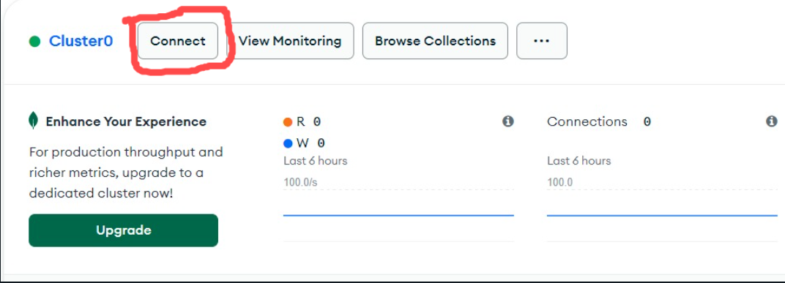
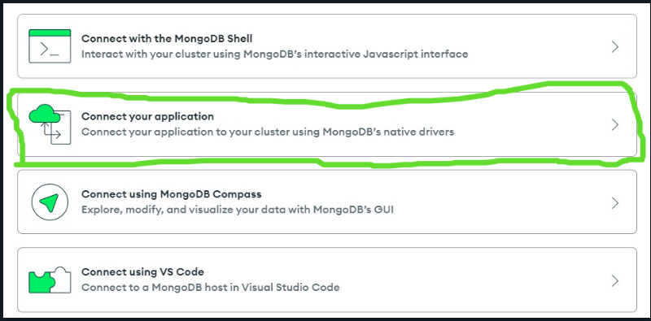
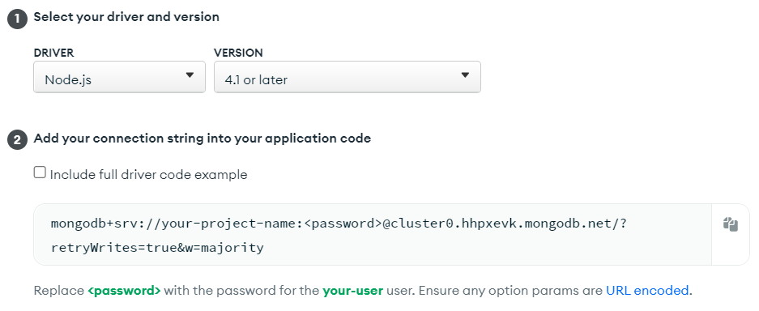
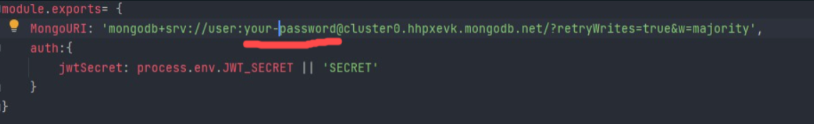
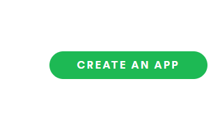
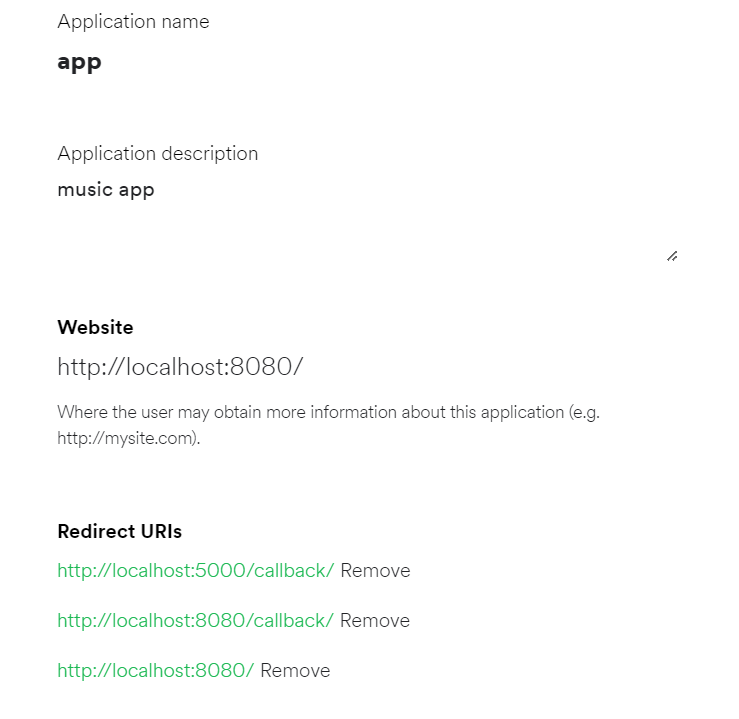
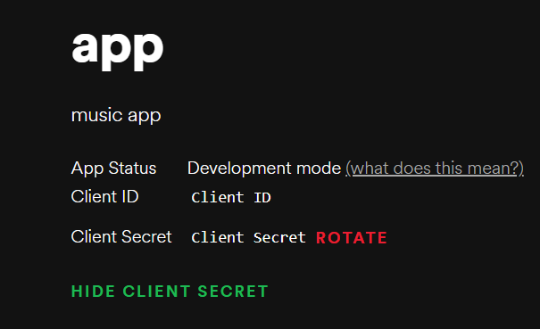
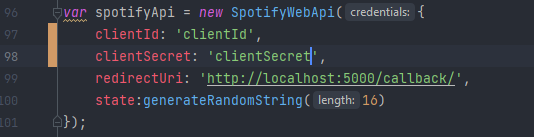

# Kamals app || spotifyClone #

Spotify clone with webSDK you could do almost everything with this project that you are doing in spotify 
 
 Technologies that are used in this project (vue.js ,node.js,mongoDB,js,html5,css)
 
 
<strong style="color:#dd163b">This project made with Node.js 14.18.2 </strong>
 

#Contents of README
* What is in this repository ? 
* Installing Packages
* Connect mongoDb  
* Integration with Spotify 

### What is in this repository ? ###

* Spotify clone
* New Track algorithm for spotify search [Go to file](back/controllers/AlgorithmController.js)
* Web Playback SDK usage [Go to file](front/src/App.vue)
* Avarage image color finder [Go to File](front/src/views/PlaylistsDetail.vue)
* Progress bar [Go to File](front/src/components/Player/SpotifyPlayer.vue)
* Drag Drop without libary [Go to File](front/src/components/Header/SideHeader.vue)
* Spotify Player [Go to File](front/src/components/Player/SpotifyPlayer.vue)
* Spotify Player Fullscreen [Go To File](front/src/components/Player/FullScreen.vue)
* Infinite Scroll [Go to File](front/src/components/PlaylistDetail/Tracks.vue)
* Search by keyup [Go to file](front/src/components/Header/TopHeader.vue)
* Spotify Loaders [Go to Folder](front/src/components/Loaders)
* Get current queue [Go to File](back/controllers/AlgorithmController.js)

### How do I get set up? ###

# Installing packages (npm)

-If you dont have node installed on your computer please download [node](https://nodejs.org/en/)

First of all, you need to open two terminals,
path one must go to the front and the other must go to the back,
then you need to use the `npm install` code in both of these separate terminals.

# Connect mongoDB 
* First of all Login or sign-up mongodb from [here](https://account.mongodb.com/account/login) 
* Please Create a new project or cluster 
    
  
    

* After creating a project or cluster you will see a screen like this please click connect
after that we will see a pop-up like this
  
* Please select connect your application 

  
* After that you will see a screen like this please copy the string and past it your code 
  

  
### (!!! Warning) You should change the your-password (underlined) value with your password

* [Go to Code](back/config/config.js)

After that we are good to go

# Integration with spotify

* Login or Register https://developer.spotify.com/dashboard/applications

* Then on the dashboard page please click the create an app button

* Here is the example of filled pop up 

*  After creating a app click to app created app and then we will see a page like this get the client ID and client secret for api
 

  
* Then we should paste the client id and secret on [app js](back/app.js:96)

*  After you need to open two terminals,path one must go to the front and the other must go to the back

*  on your backend root please type `nodemon app`

*  on your front root please type `npm run serve`

*  Then Please go to your root [localhost:5000/get](localhost:5000/get) for getting a token from spotify After all we are good to go 

### Contributing
Pull requests are welcome. For major changes, please open an issue first to discuss what you would like to change.

### Who do I talk to? ###
 
* Repo owner
